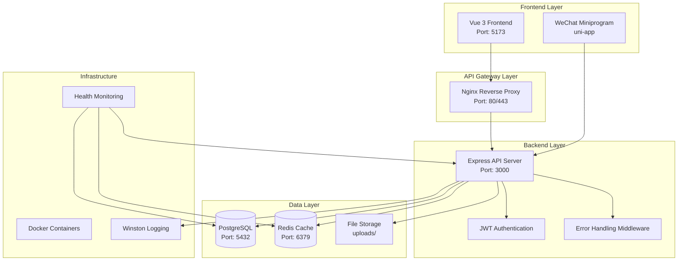

# Design Document

## Overview

This design document outlines the systematic approach to resolving all runtime errors in the cattle management system. The solution focuses on creating a robust, error-free environment where the backend API, frontend web application, and WeChat miniprogram can operate seamlessly with consistent data contracts and reliable connectivity.

The system consists of three main components:
- **Backend API**: Node.js/Express server with PostgreSQL database
- **Frontend Web**: Vue 3 application with Element Plus UI
- **Miniprogram**: WeChat miniprogram using uni-app framework

## Architecture

### System Architecture Overview



### Error Resolution Strategy

The design follows a layered approach to error resolution:

1. **Infrastructure Layer**: Environment configuration and service connectivity
2. **Data Layer**: Database schema consistency and connection reliability
3. **API Layer**: Route registration and data contract standardization
4. **Integration Layer**: Frontend-backend communication and error handling
5. **Application Layer**: Component-level error handling and user experience

## Components and Interfaces

### 1. Environment Configuration Manager

**Purpose**: Centralized environment configuration validation and management

**Key Features**:
- Environment variable validation on startup
- Configuration schema enforcement
- Environment-specific defaults
- Configuration hot-reloading for development

**Interface**:
```typescript
interface ConfigManager {
  validateEnvironment(): Promise<ValidationResult>
  getConfig(key: string): any
  setConfig(key: string, value: any): void
  reloadConfig(): Promise<void>
}
```

### 2. Database Connection Manager

**Purpose**: Reliable database connectivity with automatic retry and health monitoring

**Key Features**:
- Connection pooling with automatic retry
- Health check endpoints
- Migration management
- Connection state monitoring

**Interface**:
```typescript
interface DatabaseManager {
  connect(): Promise<Connection>
  healthCheck(): Promise<HealthStatus>
  runMigrations(): Promise<MigrationResult>
  getConnectionStatus(): ConnectionStatus
}
```

### 3. API Route Registry

**Purpose**: Centralized route registration and validation system

**Key Features**:
- Automatic route discovery and registration
- Route conflict detection
- API documentation generation
- Route health monitoring

**Interface**:
```typescript
interface RouteRegistry {
  registerRoute(route: RouteDefinition): void
  validateRoutes(): ValidationResult
  getRouteMap(): Map<string, RouteHandler>
  generateApiDocs(): ApiDocumentation
}
```

### 4. Data Contract Validator

**Purpose**: Ensure consistent data structures between frontend and backend

**Key Features**:
- Request/response schema validation
- Type safety enforcement
- Contract versioning
- Automatic contract testing

**Interface**:
```typescript
interface ContractValidator {
  validateRequest(schema: Schema, data: any): ValidationResult
  validateResponse(schema: Schema, data: any): ValidationResult
  generateTypeDefinitions(): TypeDefinitions
  runContractTests(): TestResults
}
```

### 5. Error Handler Middleware

**Purpose**: Centralized error handling and logging system

**Key Features**:
- Structured error logging
- Error categorization and routing
- User-friendly error messages
- Error recovery mechanisms

**Interface**:
```typescript
interface ErrorHandler {
  handleError(error: Error, context: RequestContext): ErrorResponse
  logError(error: Error, context: RequestContext): void
  categorizeError(error: Error): ErrorCategory
  generateErrorResponse(error: Error): ApiResponse
}
```

### 6. Frontend API Client

**Purpose**: Unified API communication layer for frontend applications

**Key Features**:
- Automatic retry logic
- Request/response interceptors
- Error handling and user feedback
- Cross-platform compatibility (web + miniprogram)

**Interface**:
```typescript
interface ApiClient {
  request<T>(config: RequestConfig): Promise<ApiResponse<T>>
  get<T>(url: string, params?: any): Promise<T>
  post<T>(url: string, data?: any): Promise<T>
  handleError(error: ApiError): void
}
```

## Data Models

### 1. Error Tracking Model

```typescript
interface ErrorLog {
  id: string
  timestamp: Date
  level: 'error' | 'warn' | 'info'
  category: 'database' | 'api' | 'auth' | 'validation' | 'system'
  message: string
  stack?: string
  context: {
    userId?: string
    requestId: string
    endpoint?: string
    userAgent?: string
    ip?: string
  }
  resolved: boolean
  resolution?: string
}
```

### 2. Health Check Model

```typescript
interface HealthStatus {
  service: string
  status: 'healthy' | 'degraded' | 'unhealthy'
  timestamp: Date
  checks: {
    database: CheckResult
    redis: CheckResult
    fileSystem: CheckResult
    externalServices: CheckResult[]
  }
  uptime: number
  version: string
}
```

### 3. Configuration Model

```typescript
interface SystemConfig {
  environment: 'development' | 'test' | 'production'
  database: {
    host: string
    port: number
    name: string
    user: string
    password: string
    ssl: boolean
    poolSize: number
  }
  redis: {
    host: string
    port: number
    password?: string
    db: number
  }
  jwt: {
    secret: string
    expiresIn: string
  }
  cors: {
    origins: string[]
    credentials: boolean
  }
  upload: {
    path: string
    maxSize: number
    allowedTypes: string[]
  }
}
```

### 4. API Response Model

```typescript
interface StandardApiResponse<T = any> {
  success: boolean
  data?: T
  message?: string
  errors?: ValidationError[]
  pagination?: {
    total: number
    page: number
    limit: number
    totalPages: number
  }
  meta?: {
    timestamp: string
    requestId: string
    version: string
  }
}
```

## Error Handling

### Error Categories and Handling Strategy

#### 1. Infrastructure Errors
- **Database Connection Failures**: Automatic retry with exponential backoff
- **Redis Connection Issues**: Graceful degradation without cache
- **File System Errors**: Alternative storage mechanisms
- **Network Connectivity**: Circuit breaker pattern implementation

#### 2. Application Errors
- **Route Not Found**: Automatic route registration validation
- **Authentication Failures**: Clear error messages and redirect handling
- **Authorization Errors**: Role-based error responses
- **Validation Errors**: Field-level error reporting

#### 3. Data Errors
- **Schema Mismatches**: Automatic data transformation
- **Missing Properties**: Safe navigation with defaults
- **Type Conversion**: Robust type coercion with validation
- **Pagination Issues**: Consistent pagination handling

#### 4. Integration Errors
- **API Communication**: Retry logic with exponential backoff
- **Cross-Origin Issues**: Dynamic CORS configuration
- **Content-Type Mismatches**: Automatic content negotiation
- **Timeout Handling**: Configurable timeout with user feedback

### Error Recovery Mechanisms

```typescript
interface ErrorRecoveryStrategy {
  // Automatic retry with exponential backoff
  retryWithBackoff(operation: () => Promise<any>, maxRetries: number): Promise<any>
  
  // Circuit breaker for external services
  circuitBreaker(service: string, operation: () => Promise<any>): Promise<any>
  
  // Graceful degradation
  fallbackOperation(primary: () => Promise<any>, fallback: () => Promise<any>): Promise<any>
  
  // Health check and recovery
  healthCheckAndRecover(service: string): Promise<void>
}
```

## Testing Strategy

### 1. Unit Testing
- **Backend Controllers**: Test all API endpoints with mock data
- **Frontend Components**: Test component behavior and API integration
- **Utility Functions**: Test error handling and data transformation
- **Middleware**: Test authentication, validation, and error handling

### 2. Integration Testing
- **API Integration**: Test frontend-backend communication
- **Database Integration**: Test data persistence and retrieval
- **Authentication Flow**: Test login, token refresh, and logout
- **File Upload**: Test file handling and storage

### 3. End-to-End Testing
- **User Workflows**: Test complete user journeys
- **Cross-Platform**: Test web and miniprogram functionality
- **Error Scenarios**: Test error handling and recovery
- **Performance**: Test system performance under load

### 4. Contract Testing
- **API Contracts**: Validate request/response schemas
- **Data Contracts**: Ensure frontend-backend data consistency
- **Version Compatibility**: Test API version compatibility
- **Breaking Changes**: Detect and prevent breaking changes

### Testing Tools and Framework

```typescript
interface TestingFramework {
  // Unit testing
  unitTest: {
    framework: 'Jest'
    coverage: 'minimum 80%'
    mocking: 'comprehensive'
  }
  
  // Integration testing
  integrationTest: {
    framework: 'Supertest + Jest'
    database: 'test database isolation'
    apis: 'all endpoints covered'
  }
  
  // E2E testing
  e2eTest: {
    framework: 'Playwright'
    browsers: ['Chrome', 'Firefox', 'Safari']
    mobile: 'responsive testing'
  }
  
  // Contract testing
  contractTest: {
    framework: 'Pact'
    schemas: 'JSON Schema validation'
    versioning: 'semantic versioning'
  }
}
```

## Implementation Phases

### Phase 1: Infrastructure Stabilization
- Environment configuration validation
- Database connection reliability
- Redis connection with fallback
- Basic health monitoring
- Logging infrastructure

### Phase 2: API Layer Fixes
- Route registration and validation
- Middleware error handling
- Authentication and authorization
- Request/response standardization
- API documentation

### Phase 3: Data Contract Consistency
- Schema validation implementation
- Type definition generation
- Frontend API client updates
- Error handling improvements
- Data transformation utilities

### Phase 4: Integration Testing
- Comprehensive test suite
- Automated testing pipeline
- Performance benchmarking
- Security testing
- Cross-platform validation

### Phase 5: Monitoring and Maintenance
- Production monitoring setup
- Error tracking and alerting
- Performance monitoring
- Automated recovery mechanisms
- Documentation and training

## Security Considerations

### 1. Authentication and Authorization
- JWT token validation and refresh
- Role-based access control (RBAC)
- API rate limiting
- Session management
- Password security

### 2. Data Protection
- Input validation and sanitization
- SQL injection prevention
- XSS protection
- CSRF protection
- Data encryption at rest and in transit

### 3. Infrastructure Security
- HTTPS enforcement
- CORS configuration
- Security headers
- File upload restrictions
- Environment variable protection

### 4. Monitoring and Auditing
- Security event logging
- Access pattern monitoring
- Anomaly detection
- Audit trail maintenance
- Incident response procedures

## Performance Considerations

### 1. Database Optimization
- Connection pooling
- Query optimization
- Index management
- Caching strategies
- Read replica usage

### 2. API Performance
- Response caching
- Compression middleware
- Request batching
- Pagination optimization
- Rate limiting

### 3. Frontend Optimization
- Code splitting
- Lazy loading
- Asset optimization
- CDN usage
- Service worker implementation

### 4. Monitoring and Metrics
- Response time tracking
- Error rate monitoring
- Resource utilization
- User experience metrics
- Performance alerting

## Deployment Strategy

### 1. Development Environment
- Docker Compose setup
- Hot reloading
- Debug configuration
- Test data seeding
- Development tools

### 2. Testing Environment
- Automated deployment
- Test data management
- Integration testing
- Performance testing
- Security scanning

### 3. Production Environment
- Blue-green deployment
- Health checks
- Rollback procedures
- Monitoring setup
- Backup strategies

### 4. Maintenance Procedures
- Regular updates
- Security patches
- Performance tuning
- Capacity planning
- Disaster recovery

This design provides a comprehensive framework for systematically resolving all runtime errors while establishing robust patterns for future development and maintenance.